**Hello everyone!**

For some time I posted the results of attempts in mastering the work with chocolate in the telegram channel, at the request of participants I write a detailed post on how to make candy at home. 
Writing a post for the first time, comments and criticism are welcome.

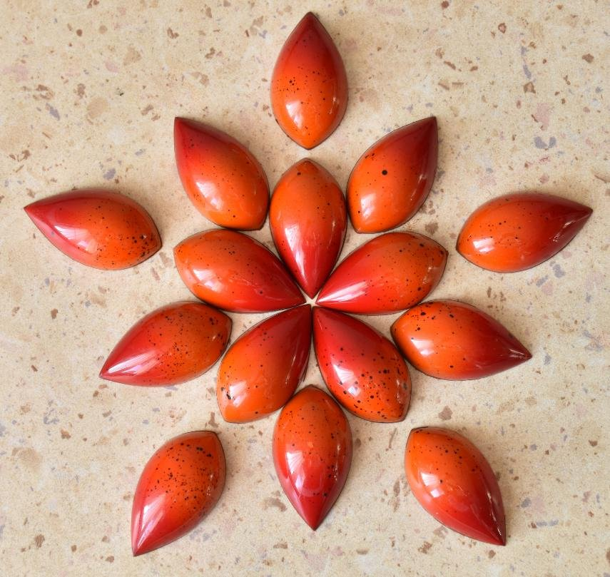

**About me:**  I've been doing fan chocolate since November 2020, during which time I've been able to get into basic things and understand some of the intricacies of working with this product. See the result you can get out of [this link, subscription is welcome :)](https://www.instagram.com/evgeny.padniuk/).

Previously, it took me about 4-5 hours for one polycarbonate mould, after several training sessions this time was reduced to 1-2 hours by 3 moulds.

## Table Of Content
```toc
exclude: Table Of Content
tight: true
```

### Step 0: Start (Equipments and Ingredients)


So, to make chocolates will need such equipment:
- Polycarbonate moulds (I use moulds from Chocolate World)
- A snous-thermometer or infrared thermometer (I have Chinese for $10)
- Submersible blender (injected dye into cocoa butter)
- Microwave (topping chocolate 10-second approaches in it)
- Hairdryer (if the temperature of the mould is low, you need to walk with a hair dryer and warm up)
- Plastic chocolate containers
- Pastry bags for toppings and chocolate
- Plastic containers for painted cocoa butter
- Glass or metal temper bowl
- Walking brushes
- Baking paper (we will pour the remaining chocolate from the mold)
- Spatula (can be construction but without rust and chrome, or confectionery)

And such ingredients:
- Cocoa butter
- fat-soluble dye (a couple of species depending on the idea)
- Chocolate (dark/milk/white)
- Fruit puree (depending on the filling)
- Nuts (almonds, hazelnuts, macadamia, pecans, anything from preferences)
- Sugar
- Glucose syrup

The thermometer is very important, because in order for the chocolate to be in the "condition", it needs to be melted and re-formed crystal structure - this process is called tempering.

Charts of temperature for different types of chocolate can be seen in the picture below, the main chocolate manufacturers indicate these markings on the packages:

 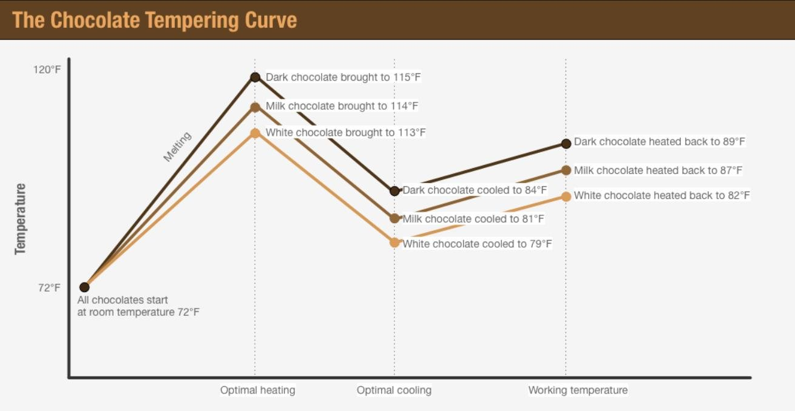

 Roughly speaking, you need to melt in the microwave chocolate to a temperature of 45 degrees Celsius, quickly cool in a metal/glass dish to 27 degrees, and warm up to a temperature of 29-31 degrees (depending on the type of chocolate) to work (because at 27 degrees the chocolate mass is already quite thick and the body of candy will be thick).

 The temperature in the room should be **18-20** degrees to work with chocolate, at other temperatures the chocolate will be worse to crystallize and the result will be worse.
 
 You need to work in nitrile gloves, so as not to leave fingerprints on the mould and not to smear hands in an oil.
 
 ### Step 1: Polycarbonate Moulds
  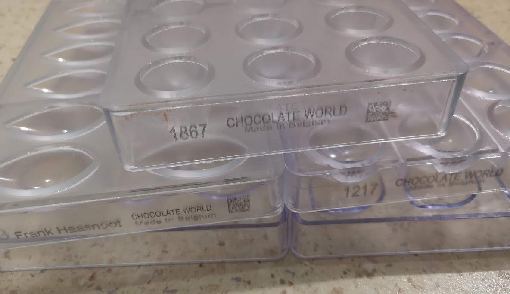

I use the molds from Chocolate World, there are also well-known manufacturers Pavoni, Martellato, Inplast, they are about the same, you can go with the Chinese, but they can be a problem - here as luck.

To work with chocolate, the molds need to be washed, dry to wipe with paper napkins, and to make sure that there are no residues of fat/cocoa butter to wipe with napkins soaked alcohol/vodka (not necessarily if properly washed).

When this is done, the shape is ready to be stained.

### Step 2: Cocoa Butter
  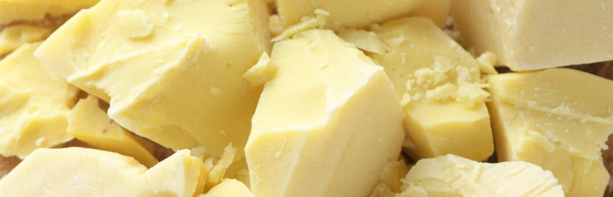

Cocoa butter for work will suit in essence anyone.

Cocoa butter is colorless, translucent. To work it needs to be painted in the desired colors. To stain you need 100 grams of oil, 5 grams of fat-soluble dye.

Since chocolate contains a percentage of cocoa butter, the principle of working with cocoa butter is similar. To start in the microwave, melt the cocoa butter to a temperature of 50-55 degrees Celsius. Pour the necessary amount of dye into the oil and punch through with a blender. I recommend pouring in and punching a little bit, controlling the color. After breaking through, the oil must be drained through a viscose napkin, so that no dye particles are caught when coloring the mold. Then reheat to 50-55 degrees colored dye and quickly cool to 26-27 degrees in glassware, heat the hairdryer to 29-30 degrees and can use or pour into plastic containers for storage.

  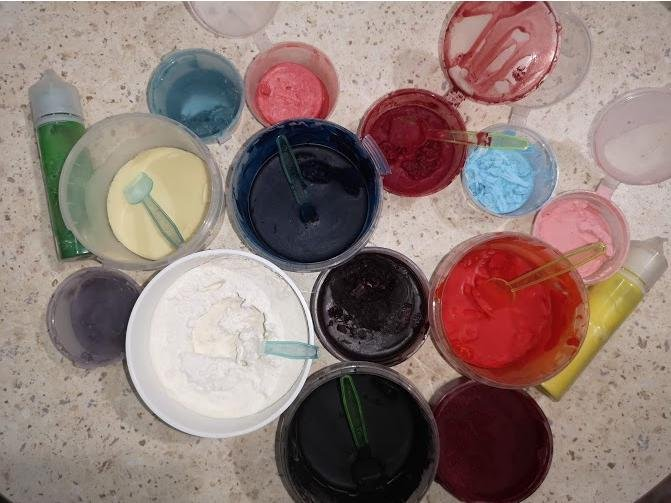

Colours can be picked up on this site: [https://trycolors.com/](https://trycolors.com/)
The principle is that we add parts of the base, and see what will be the result, but for a start it is possible with the basic.

  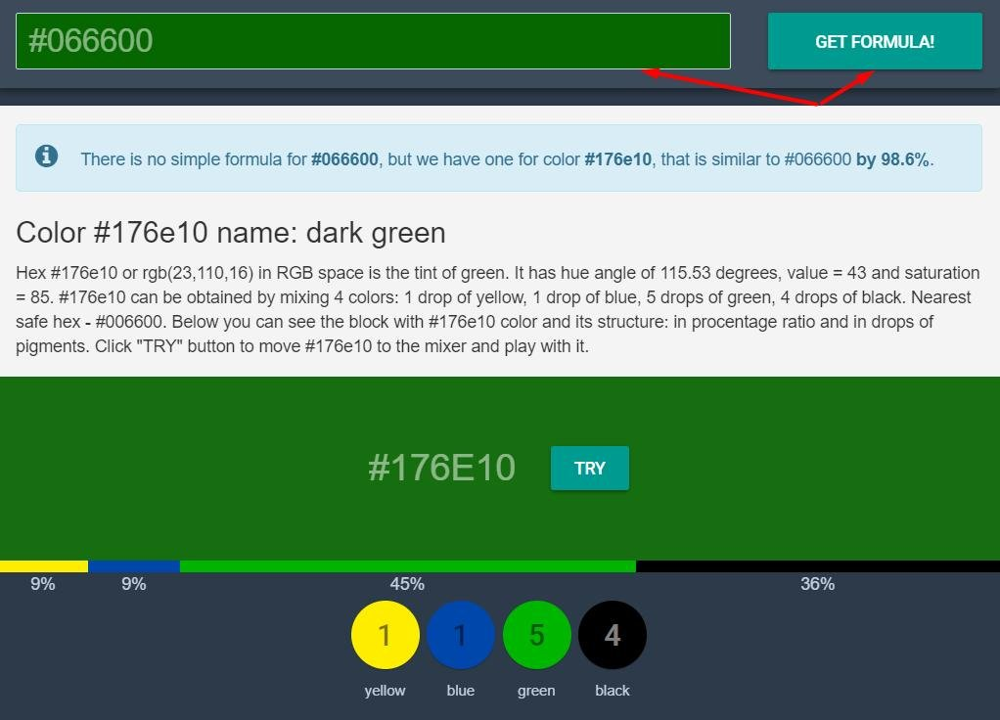

You can buy ready-made cocoa butter from ChefRubber for 20 bucks for 200 grams, but I recommend making your own coloured cocoa butter.

After cooling down, the oil crystallizes, you can reuse it as many times as you like, just heating in the microwave and tempering as described above.

If you want to skip tempering, you can heat the oil for 10 seconds, and watch until the center melts, when the center is melted, remove the oil and stir with a spoon, check if everything is good, you can just drop a drop of oil on a cold ceramic saucer, in a minute the oil should become matte. If the matte does not become, you will not be able to turn away, and will have to crank the steps on heating /remaining as described above.

 #### Step 3: Colouring mould by cocoa butter
  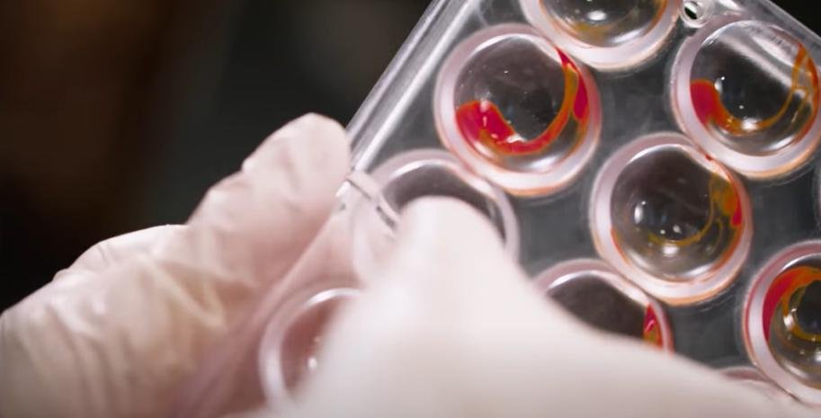
 
 Here we do what we want, open creative chakras and do our idea.

 **(!!!)** After each color, the cocoa butter on the mould should be crystallized, so that there was no mixing with the already applied colors, for this after applying a certain color you need to wait for a while. You can check with a brush or finger, if the oil does not smear and became matte, you can apply a different color.

 Once all the colors are applied, what got out of the cells, on the outside of the mould should be cleaned, so that pieces of painted oil do not get into the chocolate, you can spatula, you can have a paper napkin.
 
 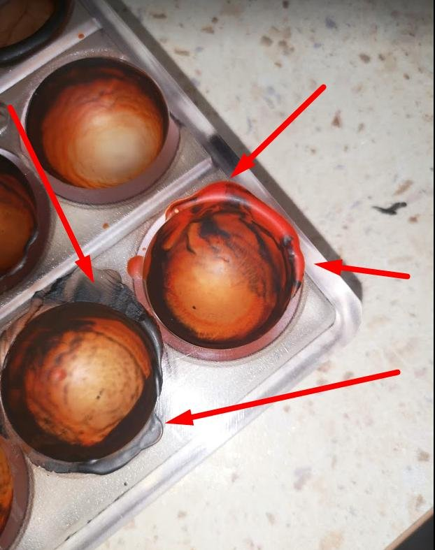

 **A couple of useful tricks:**
 - You can buy a toothbrush, dip in oil and spray your fingers on the mold, get points.
 - Dark colors shine noticeably better than light, if you want glitter-glitter, it is better to use dark contrasting colors.
 - Clean sponge for dishes, you can trim and draw it
 - In order for the colors to be brighter, the background should be applied white, because the oil is translucent, there will be a pleasant contrast

 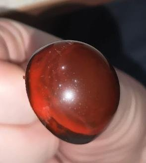
 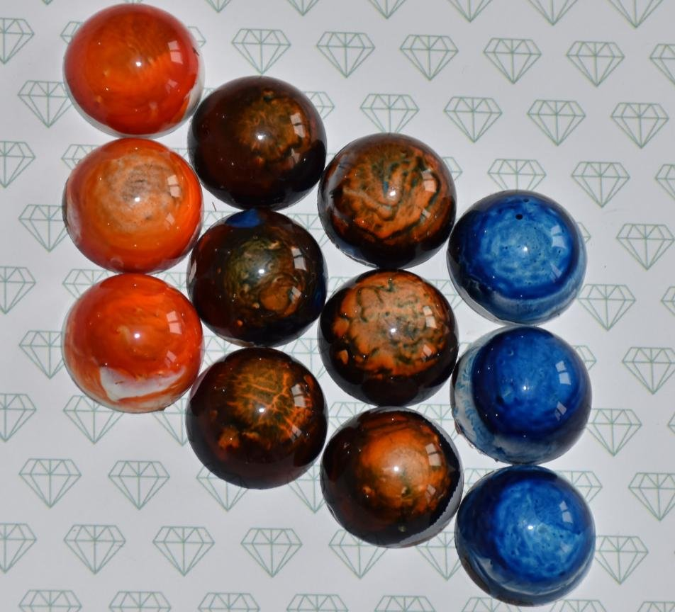
 - you can not hesitate to draw with your fingers, as shown here: 
 `youtube: https://www.youtube.com/watch?v=Sen-kIQ3dig`

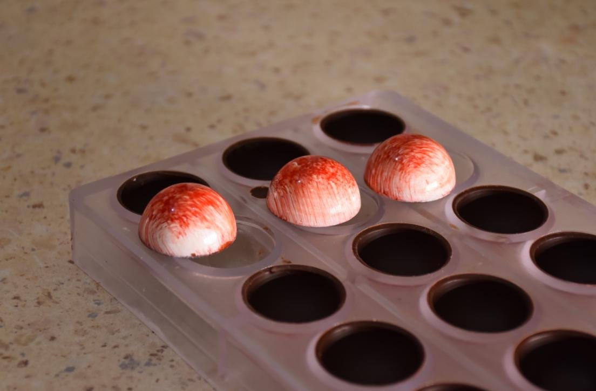
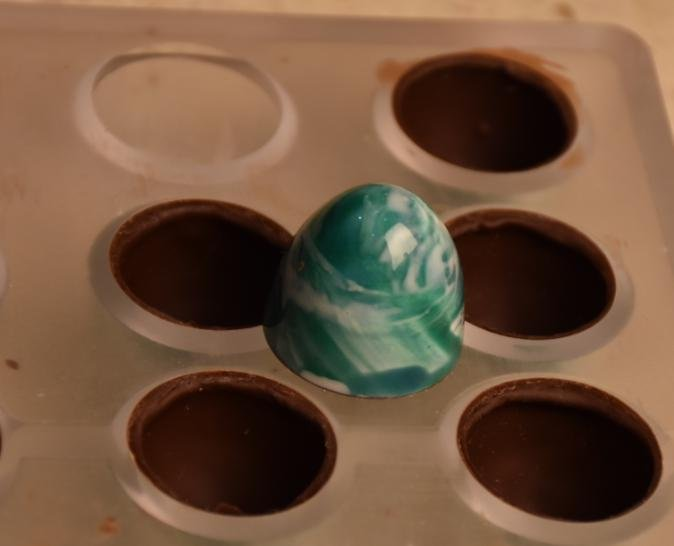
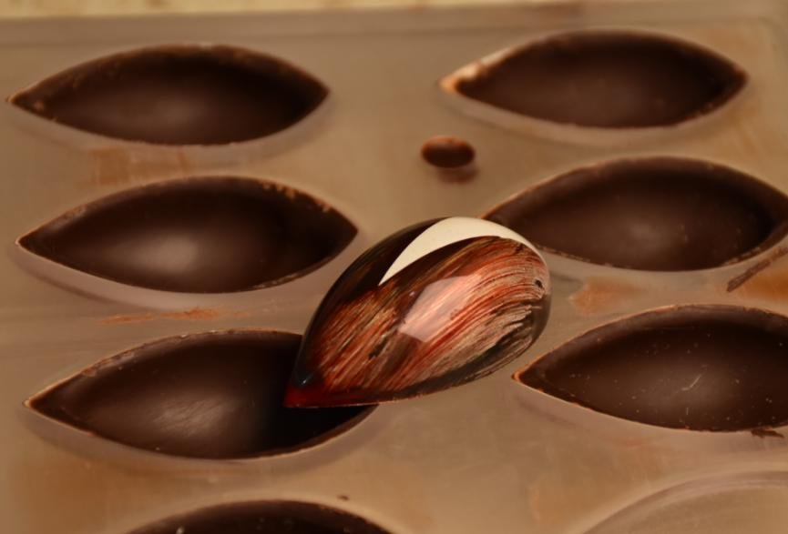

I've already bought a bunch of brushes in a couple of months, which I sometimes use.
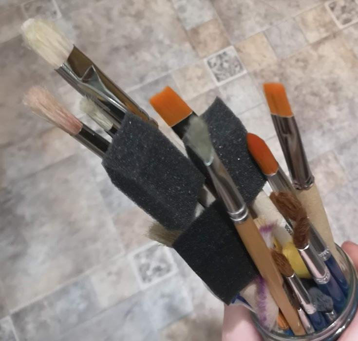

### Step 4: Fill the chocolate shells
When the shells is painted, you need to fill the mould with chocolate.

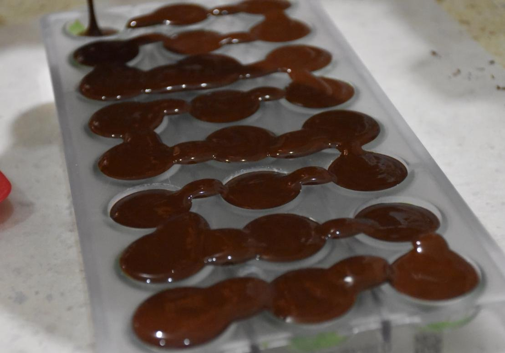

Chocolate manufacturers indicate fluidity on the packaging, as a rule, the cases need a turnover of 4 out of 5, but you can take in the pritznip any.
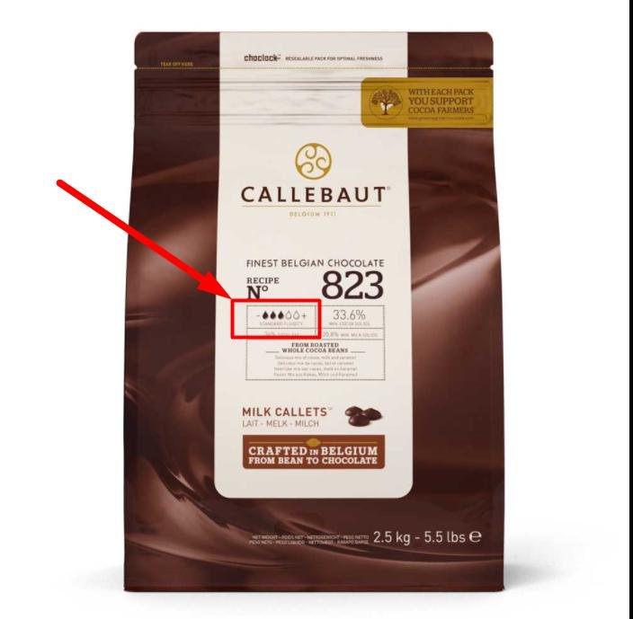

I buy Callebaut chocolate as pictured above, and I add 5% cocoa butter in calllets
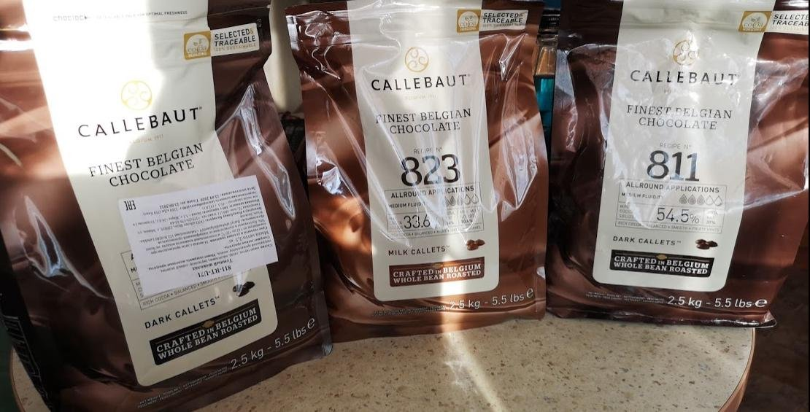
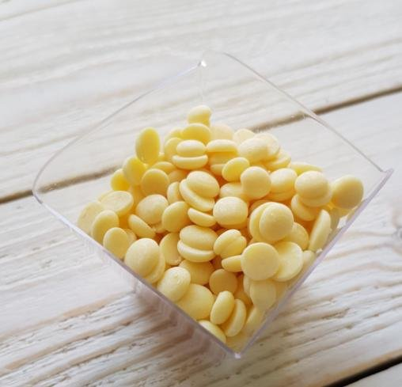
Chocolate in packages is also in calllets (drops).

**It takes about 300g of chocolate to close the mold.**

Take the right amount of chocolate, mix with 5% cocoa butter, put in a micro-wave and intervals of 15-5 seconds melt to a temperature of 45 degrees, after each iteration stir, so that some preeminated part is not overheated.

Then the container in melted chocolate, put in a container with cold water with pieces of ice (on the principle of a water bath) and stir until the temperature falls to 27 degrees.

Check if everything is OK, you can drop a drop of chocolate on a cold ceramic saucer. In a minute the drop should become matte, if all is well, you can move on.

27 degrees is a fairly thick chocolate, if you pour this into the mold, the body will be thick and will fit less filling, and the chocolate will go more. Therefore, this chocolate should be heated in the microwave to 30 degrees, just for a few seconds putting the chocolate in the oven.

Chocolate is ready, pour it into a condensed bag or in a collective-drain pour directly from the bowl to the mould caviars. When flooded, you need to knock the shape on the table, creating vibrations to tap the bubbles. Then we turn the shape over **(!!!)** And do not raise until we do all that next, pour the excess chocolate on baking parchment. knock on the mould of a silicone spoon or the type of fact to tap the excess chocolate. With a spatula remove hanging drops of chocolate.

Leave mould to crystallize for 10-30 minutes in a room with a temperature of 18-20 degrees. The inverted mould is left to keep the chocolate from flowing upwards and there is no accumulation of chocolate in the top. So it will drain on the edges evenly.

After that, you can put in the refrigerator for further crystallization.

**The shape cannot be turned over until the end of cooking**

The whole pouring process can be seen here:

`youtube:https://youtu.be/nHsdBpp4inQ`

### Step 5: Filling
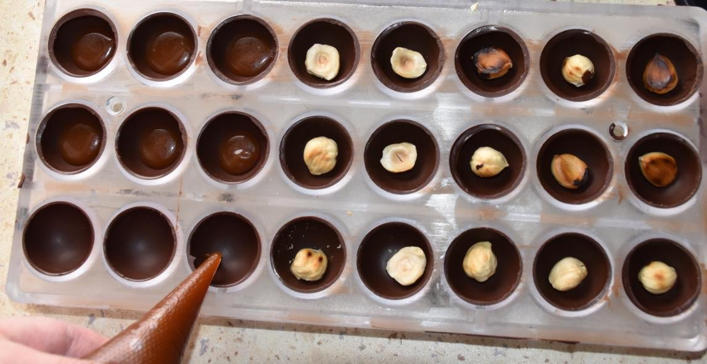

The filling for sweets is ganache, marzipan, liquid liqueurs, etc.

**IMPORTANT:** The more water in the filling, the shorter the shelf life. The shelf life of solid toppings can be half a year, and all sorts of souffles based on eggs - a month. In general, I recommend to use any candy within two to three weeks. Thus, you definitely do not make a mistake and do not poison spoiled product with almost any filling.

In industrial production there are special devices that measure the amount of water and calculate the expiration date, the price of such a device from 500 dollars and above.

#### Marzipan
The simplest filling is marzipan. We buy marzipan bread, roll balls, put in a cell, level with your hands - all, you are awesome.
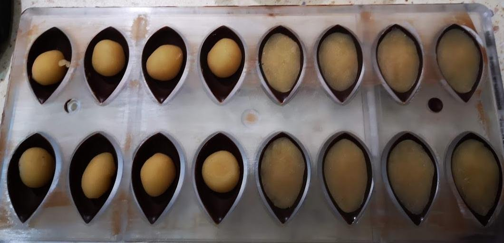

#### Gianduja
Another basic filling - **Gianduja** recipe can be seen [here](https://tarasmulticulturaltable.com/secret-recipe-club-gianduja-italian-chocolate-hazelnut-spread/). Before pouring into the mold you need to heat up to 29 degrees, pour, put in the refrigerator to thicken, close the bottom.
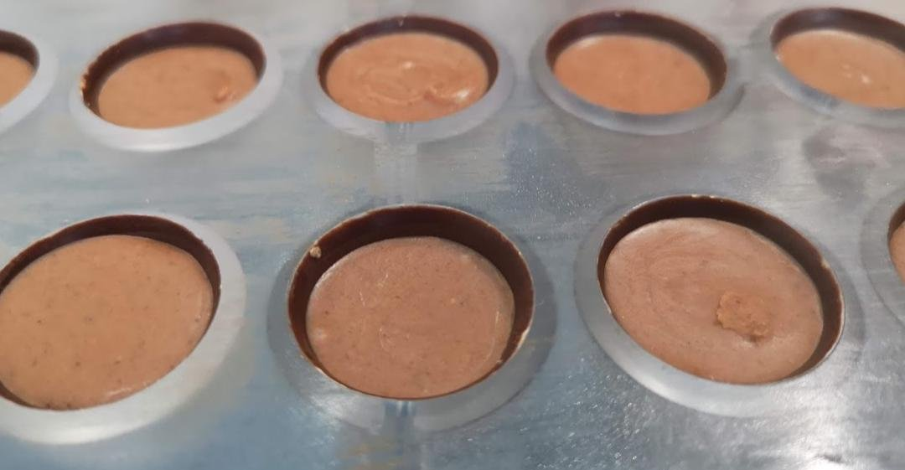

You can use hazelnut, almond, pecan, makadamia and other nuts.

#### Liqueurs/Honey/etc
Liquid fillings are difficult for beginners, because there are a lot of species, and it is difficult to close the bottom. There are quite liquid and with a sugar case (usually alcoholic).
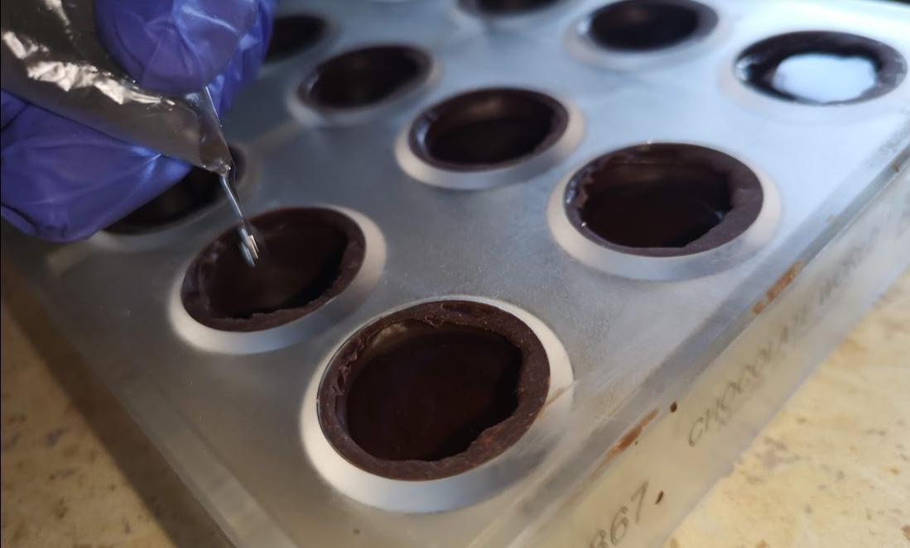

For sweets with liqueur and sugar case is prepared oversaturated with sugar syrup, poured into cells, 12 hours crystallized liqueur, close chocolate and all.

If without a sugar case, then after filling the mould to close the it you need a thin confectionery sheet of plastic format A4, on it an even layer put chocolate, the sheet is put on the mould, spatula level chocolate and leave together with a sheet to freeze, then the sheet clean, the remains of chocolate break, candy take out.

#### Ganache
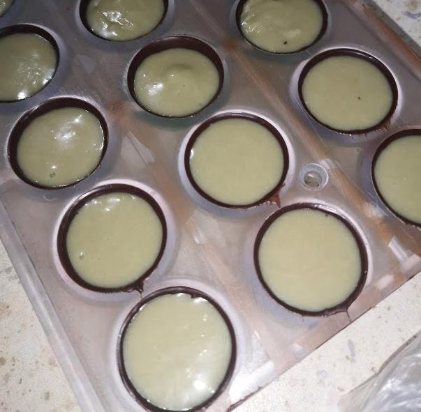
**The base for the ganache is next:**
- 110g chocolate
- 18g glucose syrup
- 80g any fruit puree
- 10g cream 33-35%

**Cooking steps:**
Combine the fruit puree and cream with glucose syrup. Heat to a boil and pour on chocolate. With a submersible blender, we break through to a homogeneous structure. pour into a pastry bag and roll on a cool table. You can store in the refrigerator, before filling the mould heated to 29-30 degrees.

**IMPORTANT:** The most difficult skill here was not to pour the filling, it is necessary that a couple of millimeters do not close to the brim, as in the photo below, if it happened that poured the fillings, remove the excess can be toothpick or syringe.

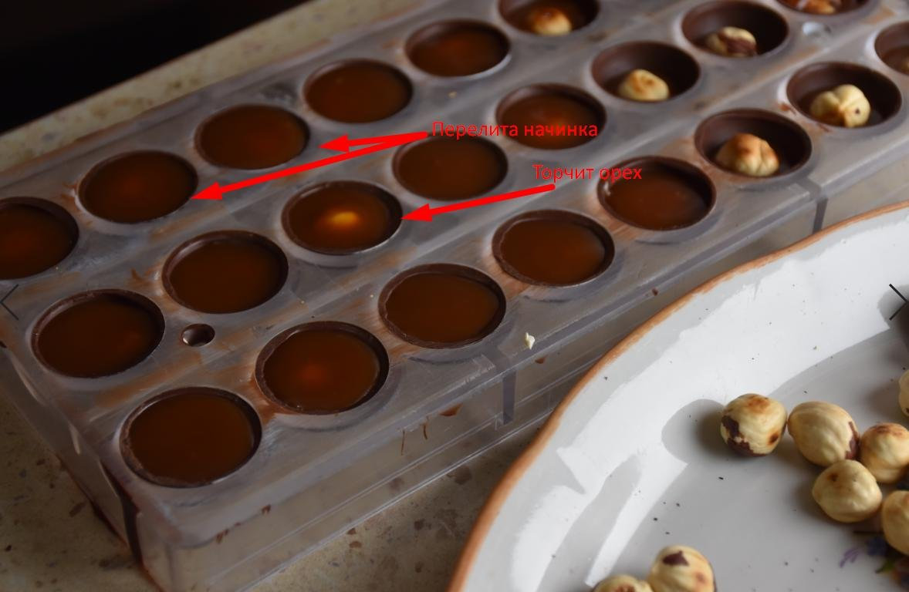

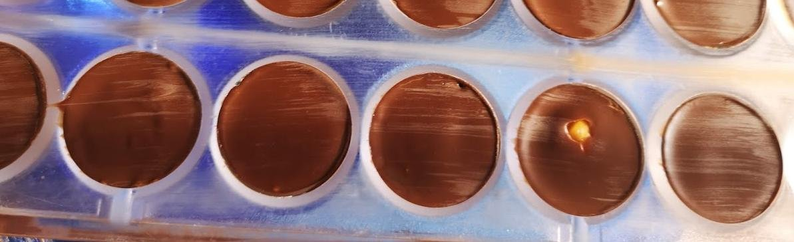

### Step 6: Close the mould and get out chocolates
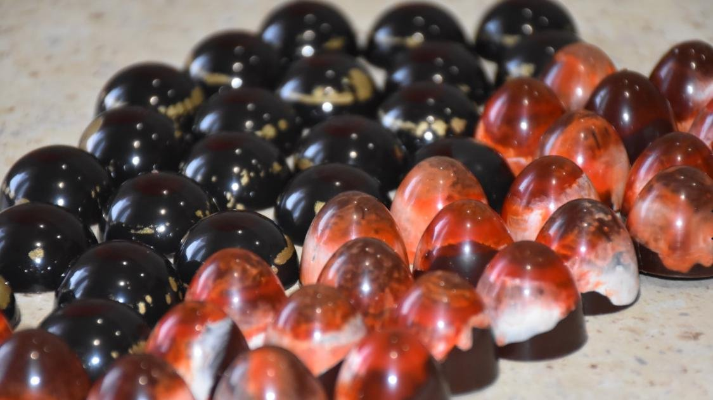

After the mould with the filling has cooled in the refrigerator and the filling has become thicker, we get the mould, let it heat up to a room temperature.

From above on the cells pass a hairdryer, but not much, literally to warm up.

We prepare chocolate as described in the **[step 4](#step-4-fill-the-chocolate-shells)**, pour it on top of the mould and remove the excess with a spatula. Leave for 20-30 minutes for crystallization and clean in the refrigerator for a couple of hours. In the cold, the cocoa butter is compressed, allowing it to move away from the mold.

All left to knock the candy out of the mould.

`youtube:https://www.youtube.com/embed/ahSOuv7kgTE`

### Step 7: You are breathtaking!
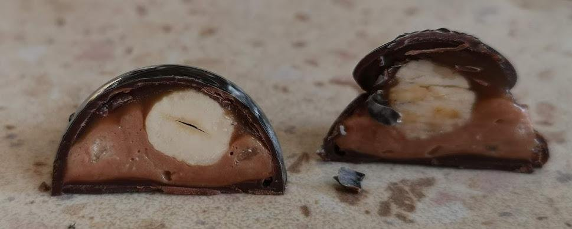

### Done
