**Всем привет!**

Некоторое время выкладывал результаты своих попыток в освоении работы с шоколадом в телеграм **Вастрик.кухни**, по просьбам участников пишу подробный пост о том, как сделать конфеты руками. Пишу пост впервые, замечания и критика приветствуется.


**О себе:** я занимаюсь шоколадом по фану с ноября 2020, за это время удалось проникнуться базовыми вещами и разобраться в некоторых тонкостях работы с этим продуктом. Посмотреть, что из этого получилось [можно по этой ссылке, по возможности подписывайтесь :)](https://www.instagram.com/evgeny.padniuk/).

Раньше на 1 форму у меня уходило около 4-5 часов, после нескольких тренировок это время сократилось до 1-2 часов на 3 формы.

## Содержание
```toc
exclude: Содержание
tight: true
```

### Шаг 0: Начало


Итак, чтобы сделать шоколданые конфеты понадобится такой инвентарь:
- Поликарбонатные формы (я использую формы от Chocolate World)
- Щуп-термометр или инфракрасный термометр (у меня китайский за 10$)
- Погружной блендер (вбиваем краситель в какао-масло)
- Микроволновка (топим шоколад 10-ти секундными подходами в ней)
- Фен (если температура формы низкая, нужно феном пройтись и подогреть)
- Пластиковые контейнеры для шоколада
- Кондитерские мешки для начинки и шоколада
- Пластиковые контейнеры для окрашенного какао-масла
- Стеклянная или металлическая миска для темперирования
- Ходожественные кисти
- Бумага для выпекания (на нее будем выливать остатки шоколада из формы)
- Шпатель (можно строительный но без ржавчины и хромированный, или кондитерский)

И такие ингридиенты:
- Какао-масло
- жирорастворимый краситель (пару видов в зависимости от задумки)
- Шоколад (темный/молочный/белый)
- Фруктовое пюре (в зависимости от начинки)
- Орехи (миндаль, фундук, макадамия, пекан, что угодно от предпочтений)
- Сахар
- Глюкозный сироп

Термометр очень важен, т.к. для того, чтобы шоколад был в "кондиции", его нужно растопить и заново сформировать кристаллическую структуру - этот процесс называется темперированием.

 Графики температур для разных видов шоколада можно посмотреть на картинке ниже, основные производители шоколада указывают эти маркировки на упаковках:

 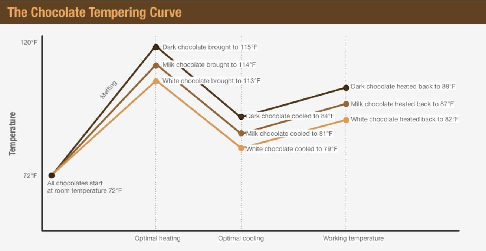

 Грубо говоря, вам нужно растопить в микроволновке шоколад до температуры 45 градусов, быстро охладить в металлической/стеклянной посуде до 27 градусов, и разогреть до температуры 29-31 градусов (в зависимости от вида шоколада) для работы (т.к. на 27 градусах шоколадная масса уже довольно густая и корпус конфеты будет толстый).

 Температура в помещении должна быть **18-20 градусов** для работы с шоколадом, при других температурах шоколад будет хуже кристаллизоваться и результат будет хуже.

 Работать нужно в перчатках, чтобы не оставить отпечатков на форме и не вымазать руки в масло.
 ### Шаг 1: Формы
  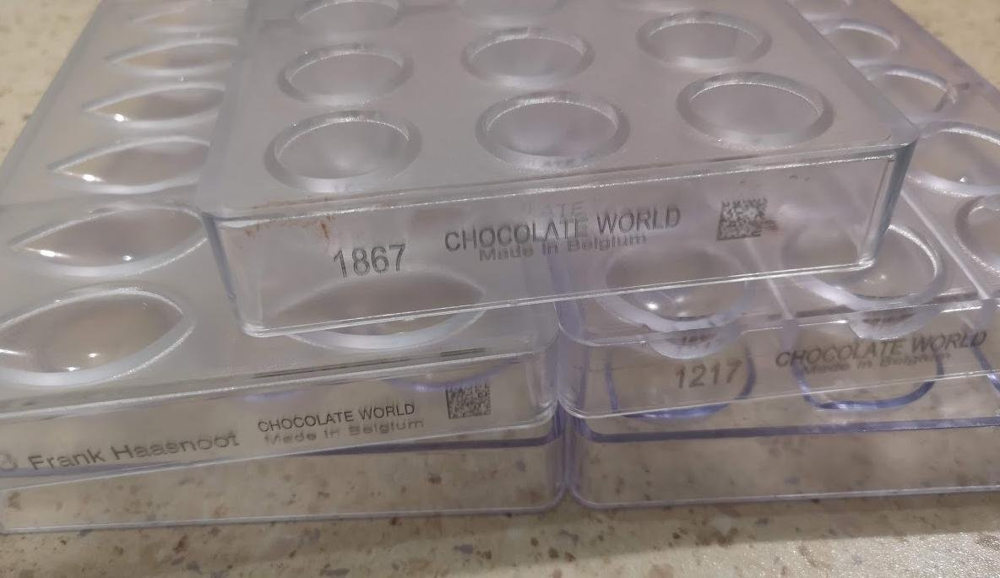

 Я использую формы от Chocolate World, есть еще известные производители Pavoni, Martellato, Inplast, стоят они примерно одинаково, можно и с китайскими, но с ними могут быть проблемы - тут как повезет.

 Для работы с шоколадом, формы нужно вымыть, насухо вытереть бумажными салфетками, и, чтобы убедиться в отсутствии остатков жира/какао-масла протереть салфетками смоченными спиртом/водкой (не обязательно если качественно промыта).

 Когда это сделано, форма готова к окрашиванию.
### Шаг 2: Какао-масло
  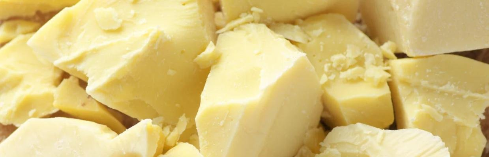

  Какао-масло для работы подойдет по сути любое.

  Какао-масло бесцветно, полупрозрачное. Для работы его нужно окрасить в желаемые цвета. Для окрашивания нужно на 100 грамм масла, 5 грамм жирорастворимого красителя.

  Так как в составе шоколада содержится процент какао-масла, то и принцип работы с ним похожий. Для начала в микроволновой печи нужно растопить какао-масло до температура 50-55 градусов по цельсию. Всыпаем необходимое количество красителя в масло и пробиваем блендером. **Рекомендую всыпать и пробивать по-немногу, контролируя цвет**. После пробития, масло необходимо процедить через вискозную салфетку, чтобы не попадалось частиц красителя при окраске формы. Далее вновь нагреваем до 50-55 градусов окрашенный краситель и быстро охлаждаем до 26-27 градусов в стеклянной посуде, подогреваете феном до 29-30 градусов и можете использовать либо перелить в пластиковую тару на хранение.

  

  Цвета можно подобрать на этом сайте: https://trycolors.com/
  Принцип такой, что добавляем части базового, и видим какой будет результирующий, но для начала можно и с базовыми.
  
  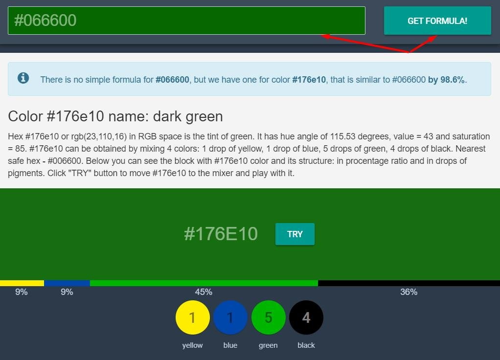

  Если влом запариваться и зп 300к/с, то можно купить готовое масло от ChefRubber по 20 баксов за 200 грамм.

  После остывания, масло кристаллизуется, переиспользовать его можно сколько угодно раз, просто разогревая в микроволновой печи и темперируя как описано выше.

  Если хотите скипнуть темперирование, то можно греть масло по 10 секунд, и смотреть пока не растопится центр, когда центр растопится, достаньте масло и помешайте ложечкой, проверить все ли хорошо, можно просто капнув каплю масла на холодное керамическое блюдце, через минуту масло должно стать матовым. Если матовым не становится, то отвертеться не удастся, и придется провернуть шаги по подогреву/оставанию как описано выше.

 #### Шаг 3: Окраска формы маслом
  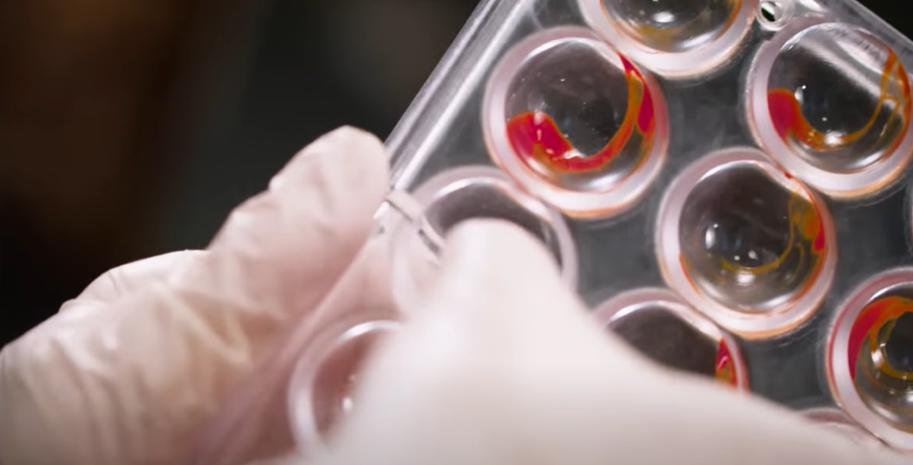
 
 Тут делаем, что хочется, раскрываем творческие чакры и мажем как карта ляжет.

 **(!!!)** После каждого цвета масло на форме должно застыть, чтобы не было смешивания с уже нанесенными цветами, для этого после нанесения определенного цвета нужно некоторое время подождать. Проверить можно кистью или пальцем, если масло не мажет и стало матовым, можно нанести другой цвет.

 После того как все цвета нанесены, то, что попало вне ячеек, на внешнюю сторону формы нужно счистить, чтобы куски окрашенного масла не попали в шоколад, можно спатулой, можно бумажной салфеткой.
 
 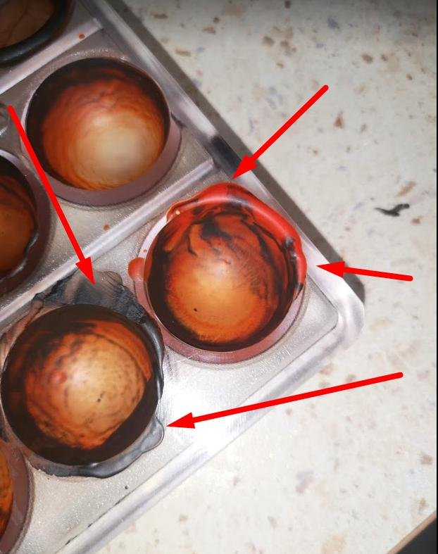

 **Пара полезных фокусов:**
 - Можно купить зубную щетку, макнуть в масло и сделать брызги пальцами на форму, получатся точки.
 - Темные цвета блестят заметно лучше чем светлые, если хотите блеск-блеск, то лучше использовать темные контрастные цвета.
 - Чистую губку для посуды, можно обрезать и рисовать ей
 - Для того чтобы цвета были ярче, на задний фон нужно нанести белый цвет, т.к. масло полупрозрачное, будет приятный контраст
 
 
 - можно не стесняться рисовать пальцами, как тут: 
 `youtube: https://www.youtube.com/watch?v=Sen-kIQ3dig`

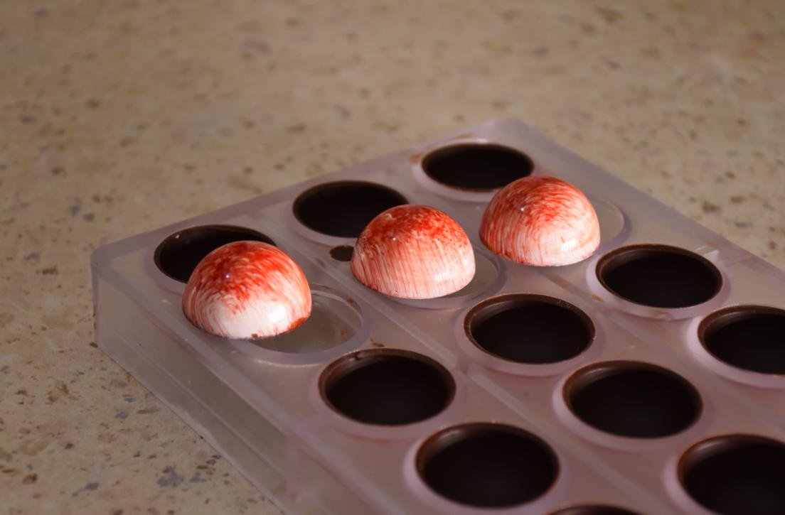


Я за пару месяцев приобрел уже кучу кистей, которыми иногда пользуюсь.
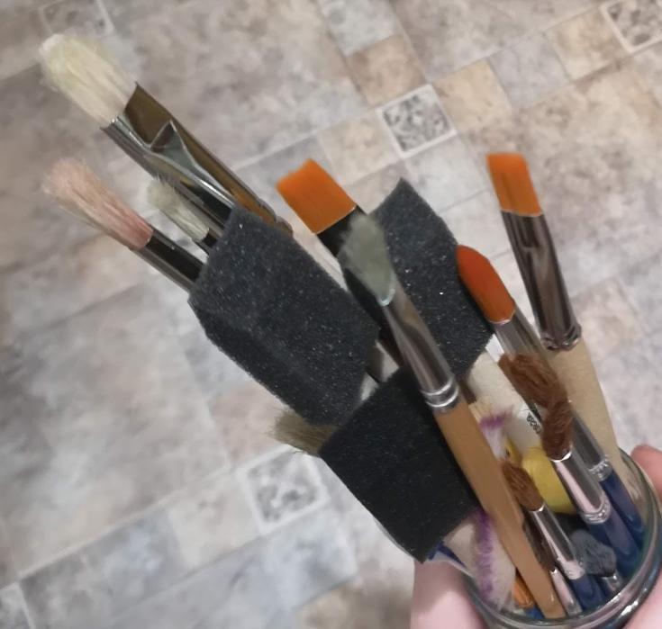

### Шаг 4: Заливаем шоколадный корпус конфеты
Когда форма окрашена, нужно залить корпус шоколадом.


Производители шоколада указывают текучесть на упаковке, как правило для корпусов необходима текучесть 4 из 5, но взять можно в прицнипе любой.
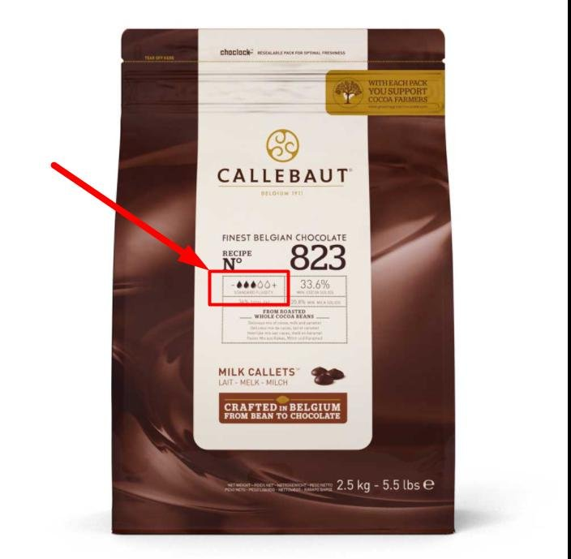

Я покупаю шоколад как на фото выше, и добавляю туда 5% какао-масла в каллетах

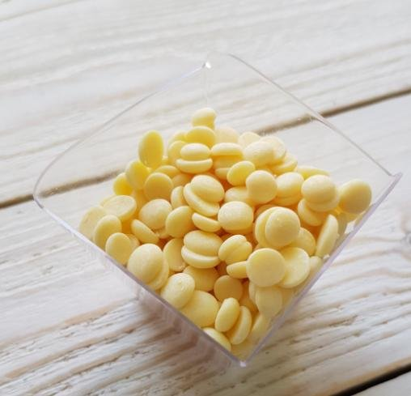
Шоколад в упаковках так же находится в каллетах (каплях).

**На закрытие формы нужно примерно 300гр шоколада. **

Берем нужное количество шоколада, смешиваем с 5% какао-масла, ставим в микороволновку и интервалами по 15-5 секунд раставливаем до температуры 45 градусов, после каждой итерации помешиваем, чтобы какая-то опеределенная часть не перегревалась.

Далее емкость в растопленным шоколадом, ставим в емкость с холодной водой с кусочками льда (по принципу водяной бани) и мешаем пока температура не упадет до 27 градусов.

Проверить все ли ок, можно капнув каплю шоколада на холодное керамическое блюдце. Через минуту капля должна стать матовой, если все хорошо, можно двигаться дальше.

27 градусов это довольно густой шоколад, если залить такой в форму, то корпус будет толстый и вместится меньше начинки, а шоколада уйдет больше. Поэтому этот шоколад нужно разогреть в микроволновке до 30 градусов, буквально на несколько секунд поставив шоколад в печь.

Шоколад готов, переливаем его в кондителский мешок или по-колхозному льем прямо из миски в ячейки формы. Когда залили, нужно постучать формой по столу, создавая вибрации, чтобы выстучать пузырьки. Потом форму переворачиваем **(!!!)** и не поднимаем пока не сделаем все что дальше, выливаем лишний шоколад на пергамент для выпекания. стучим по форме силиконовой ложкой или типо того, чтобы выстучать излишки шоколада. Шпателем убираем свисшие капли шоколада.

В перевернутом виде оставляем кристаллизоваться на 20-30 минут в комнате с температурой 18-20 градусом. перевернутой форму оставляем чтобы шоколад не стекал вверх и не было скопления шоколада в верхушке. Так он будет стекать на края равномерно.

После этого можно убрать в холодильник для дальнейшей кристаллизации.

**До конца приготовления форму переворачивать нельзя**

Весь процесс заливки можно посмотреть тут:

`youtube:https://youtu.be/nHsdBpp4inQ`

### Шаг 5: Начинка
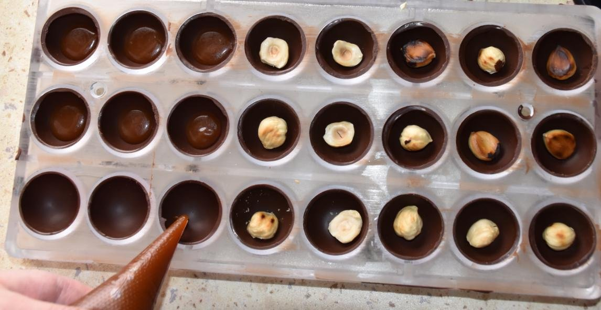

Начинка для конфет - это ганаш, марципан, жидкие ликеры и т.д.

**ВАЖНО:** чем больше воды в начинке, тем меньше срок годности. Срок годности твердых начинок может быть пол года, а всякие суфле на основе яиц - месяц. Вообще я рекомендую употребить любые конфеты в течении двух-трех недель. Таким образом вы точно не ошибетесь и не отравитесь испорченным продуктом с практически любой начинкой.

На промышленных производствах есть специальные устройства, которые измеряют количество воды и расчитывают срок годности, цена такого устройства от 500 долларов и выше.

#### Марципан
Самая простая начинка - марципан. Покупаем марципановый хлеб, накатываем шарики, кладем в ячейку, разравниваем руками - все, вы прекрасны.
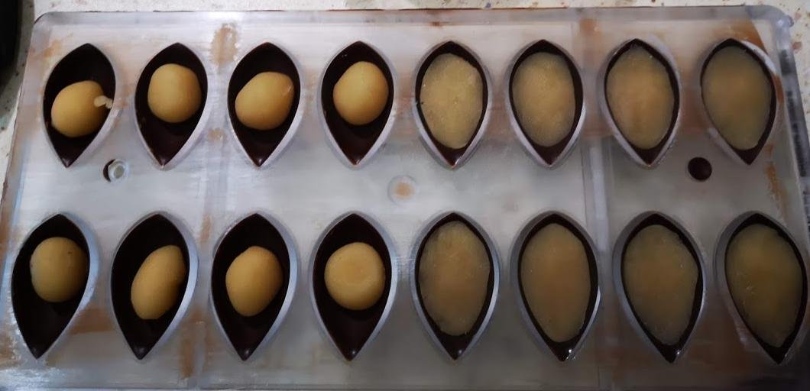

#### Джандуя
Еще одна базовая начинка - **Джандуя**, рецепт можно глянуть [тут](https://thecake-school.ru/blog/recipe/dzhandujya-shokoladno-orexovaya-pasta). Перед заливкой в форму нужно подогреть до 29 градусов, залить, поставить в холодильник чтоб загустела, закрыть дно.


#### Ликеры/Мед/etc
Жидкие начинки сложны для новичков, т.к. есть куча видов, и сложно закрыть дно. Есть совсем жидкие и с сахарным корпусом (как правило алкогольные).


Для конфет с ликером и сахарным корпусом готовится перенасыщенный сахаром сироп, заливается в ячейки, 12 часов кристаллизуется ликер, закрываем шоколадом и все.

Если без сахарного корпуса, то после наполнения формы начинкой для закрытия формы нужен тонкий кондитерский лист из пластика формата А4, на него ровным слоем наносим шоколад, лист кладется на форму, шпателем разравниваем шоколад и оставляем вместе с листом застывать, потом лист убираем, остатки шоколада обламываем, конфеты достаем.

#### Ганаш

**База для ганаша следующая:**
- 110г  шоколада
- 18г сиропа глюкозы
- 80г любого фруктового пюре
- 10г сливок 33–35%

**Готовится так:**
Соединим фруктовое пюре и сливки с сиропом глюкозы. Нагреваем до кипения и выливаем на шоколад. Погружным блендером пробиваем до однородной структуры. переливаем в кондитерский мешок и катаем по прохладному столу. Хранить можно в холодильнике, перед заполнением формы подогреваем до 29-30 градусов.

**ВАЖНО:**  Самым сложнным навыком тут было не перелить начинки, нужно чтобы пара миллиметро не закрывалось до краев, как на фото ниже, если так вышло, что перелили начинки, убрать лишнее можно зубочисткой или шприцом.
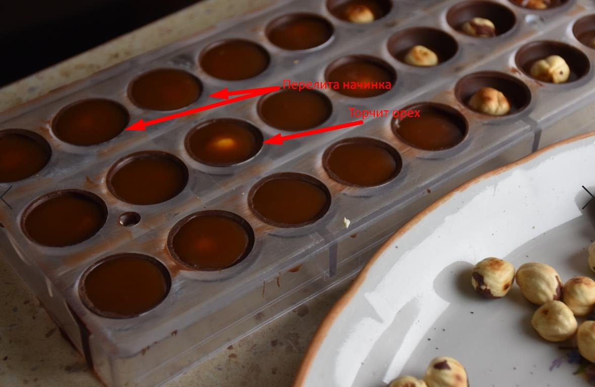


### Шаг 6: Закрываем корпус и выстукиваем конфеты


После того как форма с начинкой остыла в холодильнике а начинка стала гуще, достаем форму, даем ей нагреться до +- комнатной температуры.

Сверху по ячейкам проходимся феном, но не сильно, буквально чтобы подогреть.

Подготавливаем шоколад как описано в **[шаге 4](#шаг-4-заливаем-шоколадный-корпус-конфеты)**, наливаем его сверху  корпуса и шпателем убираем излишки. Оставляем на 20-30 минут для кристаллизации и убираем в холодильник на пару часов. В холоде какао-масло сжимается, что позволяет ему отойти от формы.

Все, осталось выбить конфеты из корпуса.

`youtube:https://www.youtube.com/embed/ahSOuv7kgTE`

### Шаг 7: Вы прекрасны


### Все
